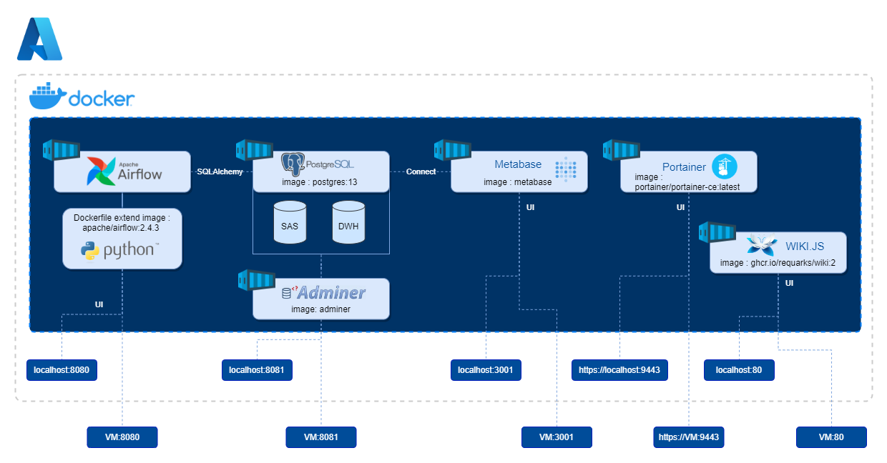

# Dockerize ETL + Datavize Pipeline

In the contexte of my university BI & Analytics degree, I have to deploy a Docker application stack on Azure Virtual machine. 

I choose to develop a simple ETL pipeline + Dataviz.
My ideas begins high, then I review my goal during the way.
I learn a lot doing it, hope it will help you.

## Architecture schema



## Installation

To use this application stack, follow these step : 

1. Clone github repo :

```bash
git clone https://github.com/malow106/My-nice-ETL-project
```
2. cd into the airflow-py folder :
   
```bash
cd My-nice-ETL-project
```

3. Intitialize Airflow docker backend containers (redis, postgresql)
   
```bash
docker-compose up airflow-init -d
```

4. Run other containers
   
```bash
docker-compose up -d
  ```

5. (Optionnal) Run documentation container   
```bash
docker-compose -f wiki\docker-compose.yml up -d
  ```

The download and install may take a while. 

See UI for services as below :  

| Services | Link     | Description                |
| :-------- | :------- | :------------------------- |
| `Airflow UI` | localhost:`8080` | Job management |
| `Adminer` | localhost:`8081` | Postgresql DB UI |
| `Metabase` | localhost:`3001` | Dataviz |
| `Portainer` | https://localhost:9443 | Container management |
| (optionnal) `Wiki.js` | localhost:`80` | Documentation |


## Services involved

### Airflow 

It's composed of mutliple services:

- `airflow-init` is the initialization service

- `airflow-workers` to execute the tasks

- `airflow-scheduler` is responsible for adding the necessary tasks to the queue

- `redis` manage the queue mechanism by forwarding messages from scheduler to worker

- `airflow-webserver` which presents a nice user interface to inspect, trigger and debug the behaviour of DAGs and tasks

- `postgres` contains information about the status of tasks, DAGs, Variables, connections, etc.

More information on arflow architecture at :  https://airflow.apache.org/docs/apache-airflow/stable/concepts/index.html

In order to install python dependencies you need to extend Airflow default image with this `dockerfile` and `requirements.txt`:
```
FROM apache/airflow:2.4.3
COPY requirements.txt /requirements.txt
RUN pip install --user --upgrade pip
RUN pip install --no-cache-dir --user -r /requirements.txt
```

### Others services
- `PostgreSQL` database : represent the analytical DWH
- `Adminer` Database management UI 
- `Metabase` Simple, userfriendly and lightweaight dataviz tool
- `Portainer` Docker container manager with shared capacities
- `Wiki.js` (optional with dedicated docker-compose) is a nice documentation plateforme
- `Production Database` (simulated by Airflow) : use `Faker`, a python package to generate fake data

### Link to docker hub

- airflow : https://hub.docker.com/r/apache/airflow
- portainer : https://hub.docker.com/r/portainer/portainer-ce
- postgres : https://hub.docker.com/_/postgres
- metabase : https://hub.docker.com/r/metabase/metabase
- wiki.js : https://hub.docker.com/r/requarks/wiki
- Adminer : https://hub.docker.com/_/adminer

## Remarks and improvements

- Instead of Airflow, use Dagster to ochestrate. Dagster is a new tool allowing declarative ochestration with the intructuction of 'assets' objects.    
-  Airflow configuration like this is heavy due to Celery worker (made for large production scalable system). You may use LocalExecutor for testing instead
-  If you want, you can initialize the postgres database on container startup with shell shell or sql scripts (see : `postgres\docker-entrypoint-initdb.d\` ) 
-  For transformation layer, a best practice will be to use `DBT` Core combined with Airflow to execute complexe transformation pipeline and testing in SQL
-  For data quality layer, you can use `Great Expectation` into DBT workflow 